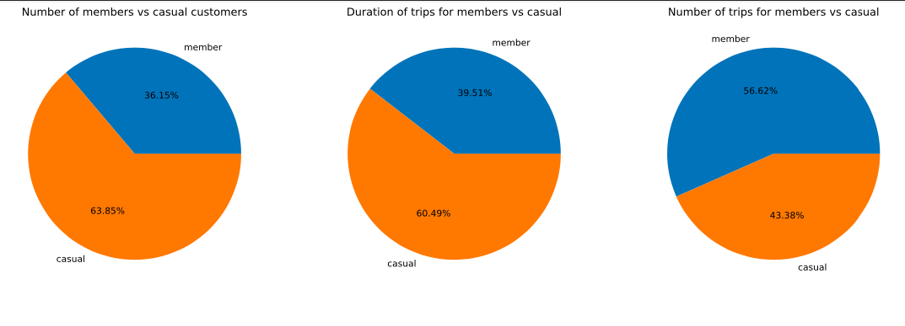
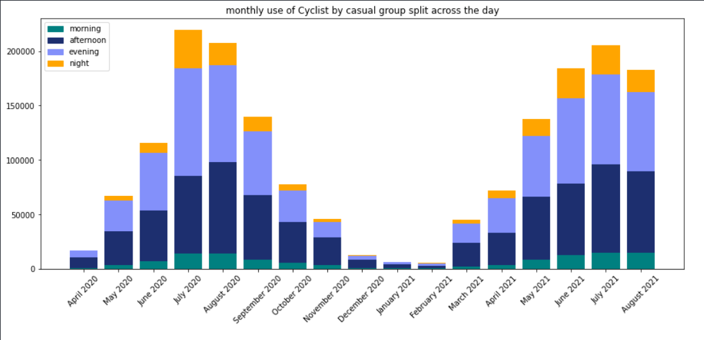

<h1 align="center"> Cyclist Bike-Share Analysis </h1>

This is the capstone project from the [Google Data Analytics Professional Certificate](https://www.coursera.org/professional-certificates/google-data-analytics). 
You can refer to or download the data [here](https://divvy-tripdata.s3.amazonaws.com/index.html).

## Problem Statement
In 2016, Cyclist launched a successful bike-share offering in Chicago where they offer multiple pricing plans:
- Single-Ride
- Full-Day
- Annual Membership

The customers who purchase single-ride or full-day passes are referred to as **casual** riders and those who purchase annual memberships are Cyclistic **members**.

The financial analysts believe that the annual members are the key to being profitable and that Cyclist should focus on marketing their membership in order to grow. Thus, the company is aiming to convert their casual riders to members and in order to do this, they want to better understand the differences between both riders and their behaviours.

In this project, we aim to clean the data and perform Exploratory Data Analysis to extract insights into both kinds of customers and the trends they follow. We will try to find and capitalise on the customer base they should target marketing at.

(You can refer to the complete problem statement in the pdf)

## Tech Stack
For this project, we will primarily be using the following in order to do our EDA and extract insights:
- Python
  - Pandas
  - Numpy 
  - Sklearn
- SQL

## Results

### Features

Our analysis focuses on the data collected from April 2020 through August 2021.
From the initial analysis of this data, we found a few key features that help us form a baseline of the user groups:
- As expected, the number of casual riders is over 1.75 times the number of members.
- The casual riders also hold most of the total trip duration having over 1.57 times the duration that members do.
- However, Cyclist members take more number of trips overall than casual riders do - 1.4 times the amount, to be precise.

### Monthly Data

As we delve deeper into the monthly data, we see some trends common to both users. The figures above show how the demand for Cyclist bikes are seasonal. The demand for bikes starts increasing in April and reaches its peak in August (this is seen in 2020 as well as 2021). Following this peak, there is a steady decline in the coming months with the winter seasons (November - February) seeing a huge drop in sales.

This is an expected trend since people are not likely to use bikes in peak winters. Here, we notice that Cyclist sales have been worse from April - June 2020 when compared to 2021 results and while these could be a result of improved marketing and brand recognition, the pandemic in 2020 (COVID-19) could have played a role. We would need to examine more data from the subsequent years to gain a better understanding of the reason.

As we compare the two figures above, we see that customers generally use Cyclist during the afternoon and in the evening with moderate use in the mornings. There is a huge decline in demand at night. While these are generally common, casual riders tend to use Cyclist at night more often than members do.

### Daily Data

We also compare the data on a daily base for each month. For the first four months in question, docked bikes were the only ones in use.

These figures corroborate our findings earlier showing that the total number of trips is higher for members while the total duration is higher for casuals. This also backs our findings in the second section showing the majority of the use is from 12pm - 6pm.

These two trends are clearly seen in every month with varying degrees. The gap between the number of trips starts closing down but the duration of trips is still higher for casual riders. Finally, from October through February we see the demand almost completely drop for casual riders. While the demand falls for members as well, its not nearly as big of a reduction.

The company introduced electric bikes in September 2020. We see that the demand for these is initially low and most use comes out of the docked bikes for two months until November when their use starts levelling out. 
In December, Cyclist brough classic bikes and they completely replaced the docked bikes altogether. In the coming months, the demand for classic bike stayed at nearly 1.8 times that of electric bikes for members. For casual riders, however, the demand for both kinds levelled off and fluctuated occassionally.

### Caveats Observed

Over the course of our analysis, we saw certain traits in the NaN values present in the data. In the data from April 2020 to August 2021, we had over 7.14 million total rides by cyclist users. Of these, 9.8% of the records had NaN values for either the start station or the end station names. 

On taking a closer look at these Nan values, we find 97% of them are from the rideable type -- 'electric bikes'. There are two possible conclusions from this: 
- If all stations have a similar distribution of bike types, there is a gap in recording the station names for electric bikes.
- Or, most of the electric bikes are concentrated in stations different from the docked and classic bikes. 

The second scenario is also supported by the fact that the electric bikes have a lower usage as shown in earlier sections, possibly because they are located in sparsely populated stations. Either way, this is an issue Cyclist needs to address. 
Furthermore, there is no difference in split between casual and member riders for these NaN values. 

## Conclusion

